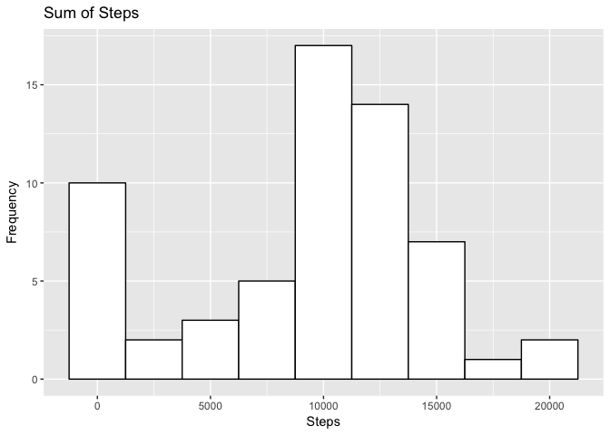
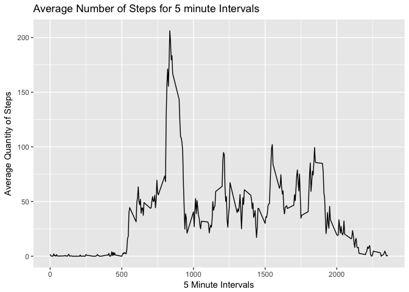
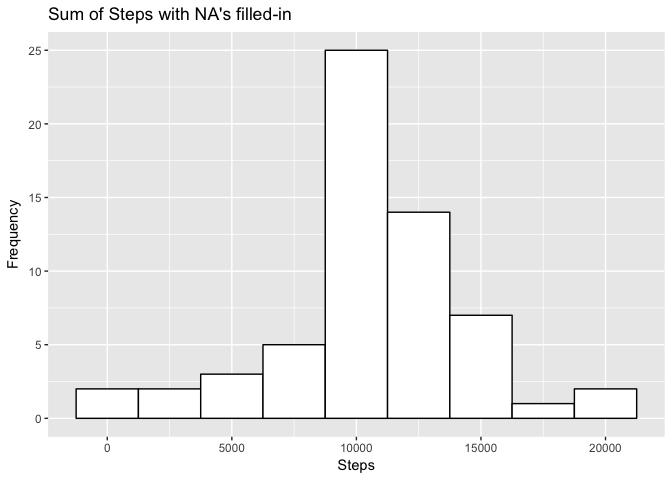
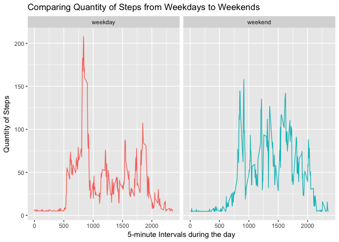

# PA1_template
# Activity Monitoring Assignment
# Coursera Reproducible Research Week 2


##### Assignment Instructions

##### This assignment makes use of data from a personal activity monitoring device. This device collects data at 5 minute intervals through out the day. The data consists of two months of data from an anonymous individual collected during the months of October and November, 2012 and include the number of steps taken in 5 minute intervals each day.


###**Load Required Libraries**


```r
library(dplyr)
```

```
## 
## Attaching package: 'dplyr'
```

```
## The following objects are masked from 'package:stats':
## 
##     filter, lag
```

```
## The following objects are masked from 'package:base':
## 
##     intersect, setdiff, setequal, union
```

```r
library(ggplot2)
```

```
## Warning: package 'ggplot2' was built under R version 3.3.2
```

```r
library(stringr)
library(lubridate)
```

```
## 
## Attaching package: 'lubridate'
```

```
## The following object is masked from 'package:base':
## 
##     date
```

###**Download Data and read into a dataframe Preprocessing data**


```r
tmpfile <- "/tmpfile.zip"
f_url <- "https://d396qusza40orc.cloudfront.net/repdata%2Fdata%2Factivity.zip"
wd <- getwd()
wdf <- paste0(wd,tmpfile)
download.file(f_url, wdf)
unzip(wdf) 
file.remove(wdf)
```

[1] TRUE

```r
amd <- read.csv("activity.csv")
```

###**Pre-process the data**

```r
amd <- mutate(amd, date = ymd(date))
```

###**Calculate the sum steps per day**


```r
amd_stats <- amd %>%
            group_by(date)    %>%
            summarise(sum_steps = sum(steps, na.rm = TRUE) )
```


### **What is the total number of steps taken per day ?**
### **Histogram of total steps per day and table of mean and median**


```r
p1 <- ggplot(data=amd_stats) + 
        geom_histogram( binwidth = 2500, 
                        aes(sum_steps),
                        fill = "white",
                        colour = "black" ) +
        xlab("Steps") +
        ylab("Frequency") +
        ggtitle("Sum of Steps")

print(p1)
```

<!-- -->

```r
steps_mean <- format(mean(amd_stats$sum_steps), digits = 2)
steps_median <- format(median(amd_stats$sum_steps), digits = 2)
```

The mean of the total amount of steps taken is 9354.
The median of the total amount of steps taken is 10395. 

##**What is the average daily activity pattern?**


```r
# Calculate the average steps per 5 minute intervals

amd_stats <- amd %>%
            group_by(interval)    %>%
            summarise(avg_steps = mean(steps, na.rm=TRUE) )

# Do a time series line chart
p2 <- ggplot(amd_stats) + geom_line( aes(x=interval,y=avg_steps)) +
        xlab("5 Minute Intervals") +
        ylab("Average Quantity of Steps") +
        ggtitle("Average Number of Steps for 5 minute Intervals")

print(p2)
```

<!-- -->

```r
# Find the interval with the maximum amount of steps
max_steps <- format(summarize(amd_stats, max(avg_steps)), digits = 2)
max_int <- amd_stats$interval[which.max(amd_stats$avg_steps)]
```

The maximum of steps is 206 and the associated interval is 835.

##**Calculate and report on the total quantity of missing values**


```r
# Calculate how many NA's in the dataset and report back in the text below
how_many_na <- sum(is.na(amd))
```

The original dataset has a total of 2304 missing values.

##**Fill-in missing values**


```r
# Missing values are calculated on the basis of the mean observations. The 
# mean of all the non-na's 5-minute interval steps are used to substitute for # # the NA's in the dataset.

amd_new <- amd
interval_mean <- mean(amd$steps, na.rm = TRUE)
na_index <- is.na(amd$steps)
amd_new$steps[na_index] <- interval_mean

how_many_na <- sum(is.na(amd_new))
```

The new dataset has a total of 0 missing values. 

##** Compare Histograms with and without NA's filled-in and report differences**


```r
amd_new_stats <- amd_new %>%
                    group_by(date)    %>%
                    summarise(sum_steps = sum(steps, na.rm = TRUE) )

p3 <- ggplot(data=amd_new_stats) + 
        geom_histogram( binwidth = 2500, 
                        aes(sum_steps),
                        fill = "white",
                        colour = "black" ) +
        xlab("Steps") +
        ylab("Frequency") +
        ggtitle("Sum of Steps with NA's filled-in")

print(p1) # Histogram from the origianl dataset with NA's
```

<!-- -->

```r
print(p3)
```

<!-- -->

```r
# Calculate the quantity of steps with no NA's
steps_mean_nna <- format(mean(amd_new_stats$sum_steps), digits = 2)
steps_median_nna <- format(median(amd_new_stats$sum_steps), digits = 2)
```

The mean of the original dataset, with NA's was 9354 which compares to 10766 from the dataset with the NA's filled-in. By adding the average to the NA's the mean value has gone down and the distribution is more
even than before.

The median of the original dataset, with the NA's 10395 which compares to 10766 from the dataset with the NA's filled-in. The
median values have changed but only slightly.

##**Are there differences in activity patterns between weekdays and weekends?**


```r
# Determine if the activity was done during the week or the weekend and
# calculate total of activities for the periods and graphs the differences

amd_new_sum <- amd_new %>%
               mutate(day_type = ifelse(wday(date, label = TRUE) == "Sat"|
                                     wday(date, label = TRUE) == "Sun",
                                     "weekend",
                                     "weekday")) %>%
               group_by(interval, day_type) %>%
               summarise(steps = mean(steps)) %>%
               arrange(day_type,interval)

p4 <- ggplot(amd_new_sum) +  
        geom_line(aes(x=interval, y=steps, color = day_type)) +
        facet_wrap(~day_type, ncol = 2, nrow=1) +
        ylab("Quantity of Steps") +
        xlab("5-minute Intervals during the day") +
        ggtitle("Comparing Quantity of Steps from Weekdays to Weekends") +
        theme(legend.position = "none")
print(p4)
```

<!-- -->
Comparing the week to weekend activities we can easily observe that in the early portion of the day, during the weekdays, the amount of steps is much greater than on weekend. The peak in the weekday period is more than 200 steps compared to about 160 for the weekend. 

During the weekend the amount of steps in the later part of the day is greater than the weekday period. This could be attributable to the fact that on weekends individual are more engaged in doing more activities whereas during the week they are mostly less active as they are in the office.
